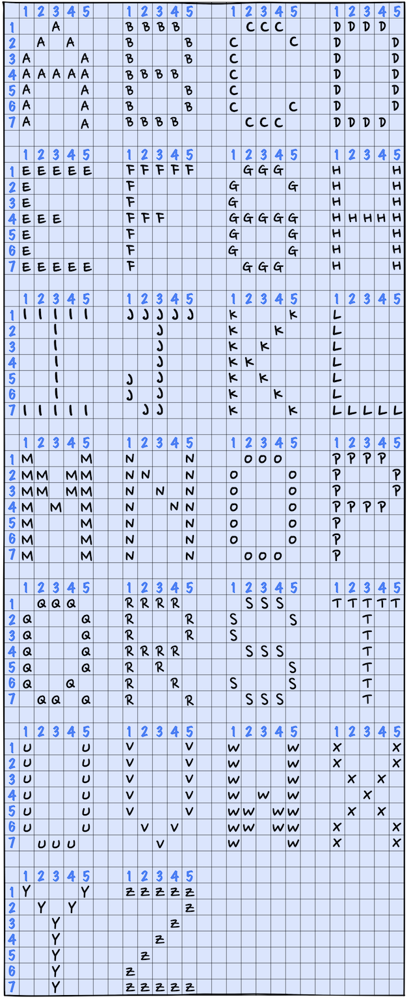

# **Block Letters**

Block Letters will output my initials to the terminal. This training project, prepared by [Codecademy](https://www.codecademy.com/learn/learn-c-plus-plus), has been an invaluable exercise in applying the knowledge I learned in learning to program C++.

## Table of Contents

- [Project Prompt](#project-prompt)
- [Technologies](#technologies)
- [Setup](#setup)
- [Sources](#sources)

## Project Prompt

Write a C++ program called initials.cpp that displays the initials of your name in block letters as shown:



Happy coding!

## Technologies

- C++

## Setup

Generally, you would want to compile and execute the program locally. To do that:

1. Download initials.cpp.
2. Open the terminal or command line and navigate to the directory where the downloaded file resides.
3. Run the following commands to compile and execute the program:

```git
g++ initials.cpp -o initials
./initials
```

## Sources

The techniques utilized was based on the lessons taught in [Codecademy's Learn C++ Course](https://www.codecademy.com/learn/learn-c-plus-plus
). The challenge is also provided by Codecademy.
